# Git

Git属于分散性版本管理系统，是为版本管理而设计的软件。

Linux--Linus在05年开发了git原型程序

SVN，CVS集中式的版本控制系统，集中存放中央服务器的

> Git is a free and open source distributed version control system designed to handle everything from small to very large projects with speed and efficiency.
>
> Git is easy to learn and has a tiny footprint with lightning fast performance. It outclasses SCM tools like Subversion, CVS, Perforce, and ClearCase with features like cheap local branching, convenient staging areas, and multiple workflows.
>
> Git 是一个免费的开源分布式版本控制系统，旨在快速高效地处理从小型到超大型项目的所有内容。 Git 易于学习，占用空间很小，性能快如闪电。它超越了Subversion，CVS，Perforce和ClearCase等SCM工具，具有廉价的本地分支，方便的暂存区域和多个工作流程等功能。

## 安装

组件的选择，默认就可以

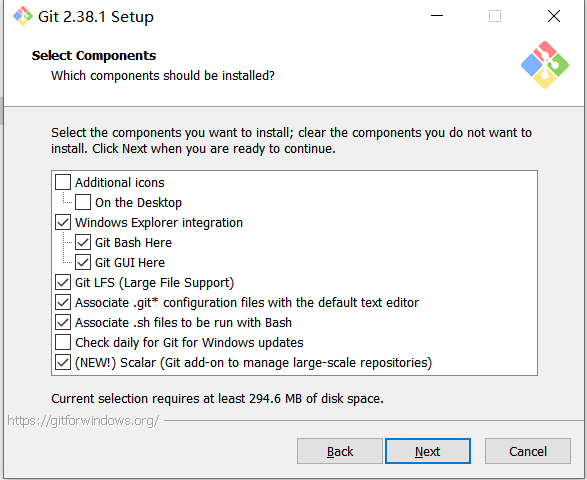

注册账号

[Gitee - 基于 Git 的代码托管和研发协作平台](https://gitee.com/)

https://github.com/

## 设置

### 设置姓名和邮箱

```shell
git config --global user.name "你的名字"
git config --global user.email "你的邮箱"
```

git config命令指定与git相关的配置

config配置级别：

- system：系统
- global：用户
- local：当前仓库

范围system>global>local

```shell
# 查看git配置
git config --list
```

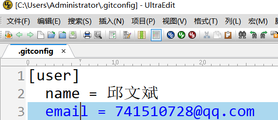

### 提高命令输出的可读性

设置color.ui为auto，让输出有更高的可读性

```shell
git config --global color.ui auto
```

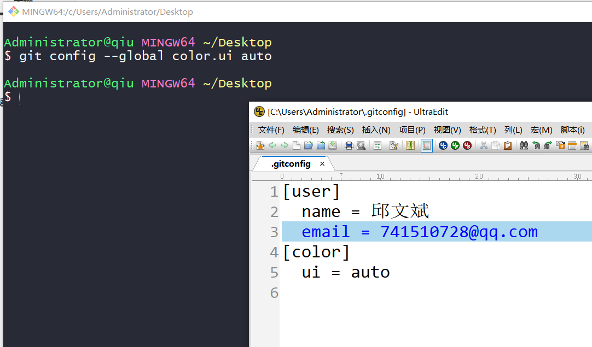

### GitHub设置

```shell
# 1、打开git bash
# 2、生成sshkey
ssh-keygen -t rsa -C "741510728@qq.com"
```

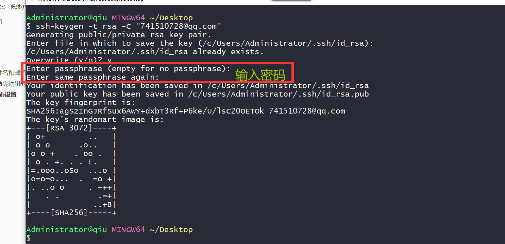

然后打开路径

`C:\Users\Administrator\.ssh`

​	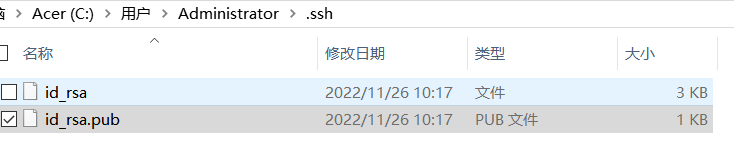

分别是私钥和公钥

我们用记事本打开公钥id_rsa.pub，然后全选复制所有内容

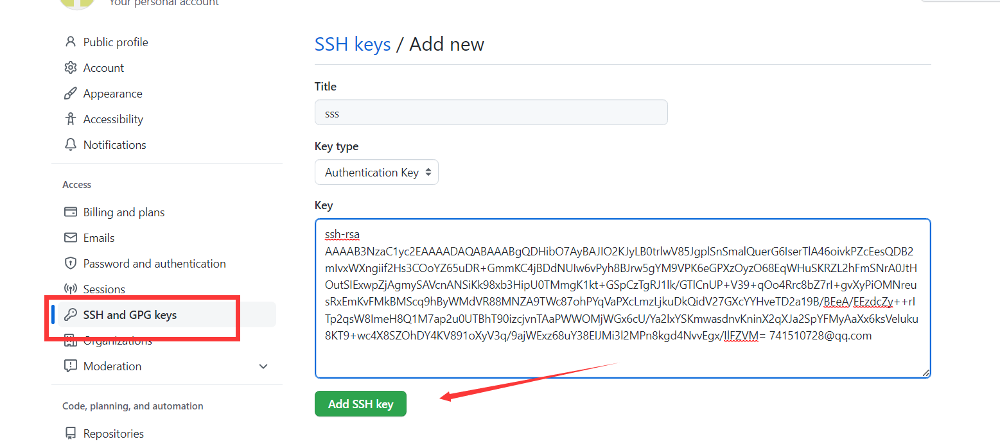

完成设置后，邮箱会收到提示邮件，这个时候，我们就可以使用私钥和GitHub进行认证和通信了。

执行命令验证

```shell
ssh -T git@github.com
```

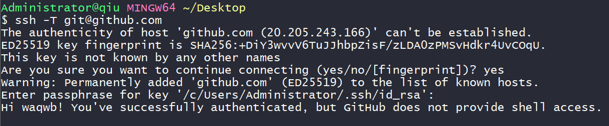

## 创建仓库

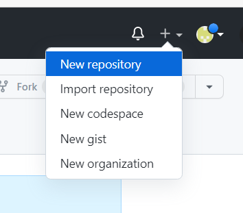

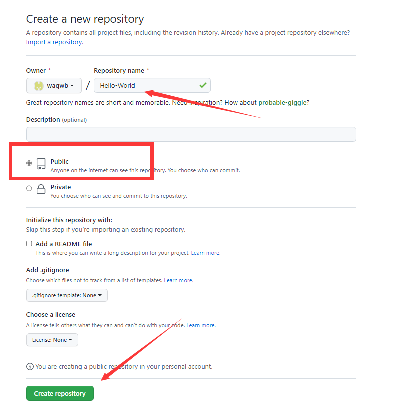

```bash
cd /f/tarena/授课/枣庄/VIP创新课程（行业）/code
# 把github上的仓库，克隆到本地
git clone https://github.com/waqwb/HelloWorld.git
```

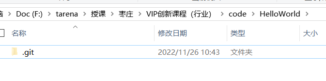

```bash
Administrator@qiu MINGW64 /f/tarena/授课/枣庄/VIP创新课程（行业）/code
$ cd HelloWorld/

Administrator@qiu MINGW64 /f/tarena/授课/枣庄/VIP创新课程（行业）/code/HelloWorld (main)
$ pwd
/f/tarena/授课/枣庄/VIP创新课程（行业）/code/HelloWorld

Administrator@qiu MINGW64 /f/tarena/授课/枣庄/VIP创新课程（行业）/code/HelloWorld (main)
$ echo "# HelloWorld" >> README.md
```

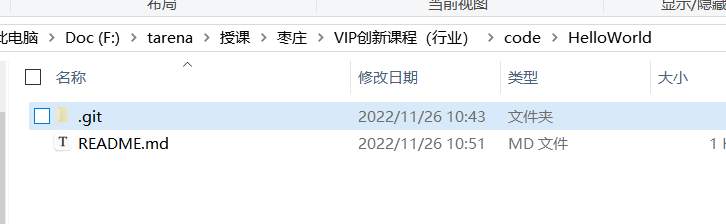

```bash
git add README.md
git commit -m "first commit"
```

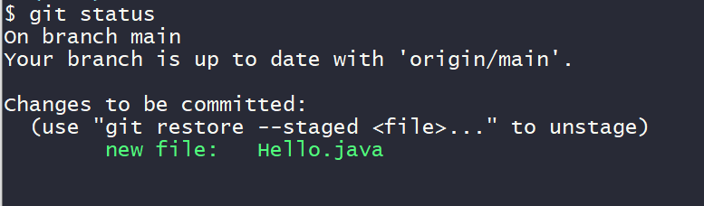

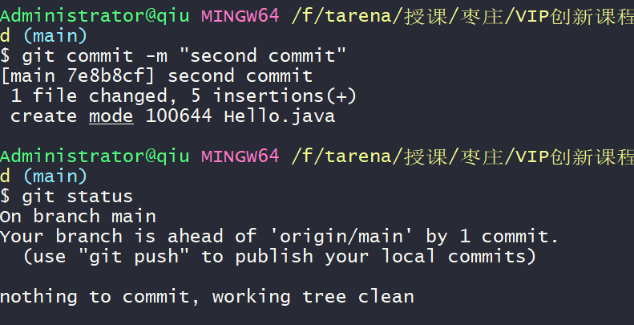

此时只是提交操作，并不会把我们目录中的内容上传至网站

```bash
git push -u origin main
```

第一次push的时候，会在git bash中有一个登录github的验证，大家验证即可

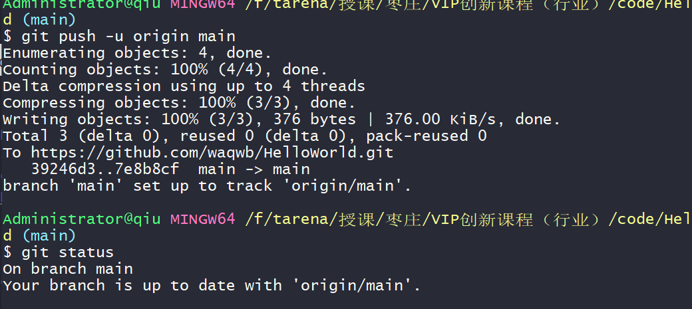

出现以下内容证明成功了，在浏览器中刷新GitHub中的仓库

## 番外

关注作者和star仓库

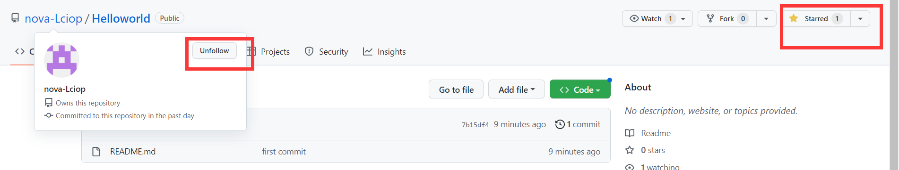

```bash
cd HelloWorld
echo "# HelloWorld" >> README.md
# 当仓库没有HelloWorld仓库的时候  .git
git init
git add README.md
git commit -m "first commit"
git branch -M main
# 指定我们要上传到的仓库的地址
git remote add origin https://github.com/waqwb/HelloWorld.git
git push -u origin main
```

## 练习

新建一个hello.java,写一段代码添加到文件中

上传至GitHub中

## Git基本操作

### 初始化仓库

```bash
git init
```

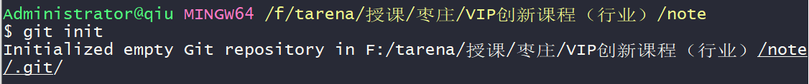

如果初始化成功，执行git init命令后会在目录下生成一个.git目录，目录中存储着管理当前目录内容所需的仓库数据。

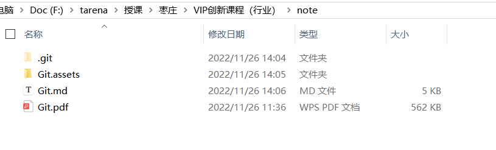

这个目录的内容称之为“附属于该仓库的工作树”

文件的编辑等操作在工作树中进行，然后记录到仓库中，以此来管理文件的历史快照。

如果想将文件恢复到原先的状态，可以从仓库中调取之前的快照，在工作树中打开。

开发者可以通过这种方式获取以往的文件。

### 查看仓库的状态

```bash
git status	
```

显示git仓库的状态。

工作树和仓库被操作的过程中，状态会不断地发生变化，可以使用这个命令来查看当前的状态。

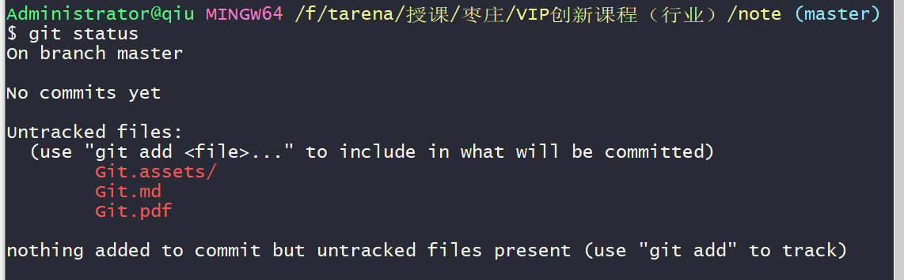

> 提交commit，记录工作树中所有文件的当前状态

### 向暂存区中添加文件

想让文件称为git仓库的管理对象，那么我们可以用`git add`命令将其加入暂存区，暂存区是一个临时区域。

```bash
git add .
```

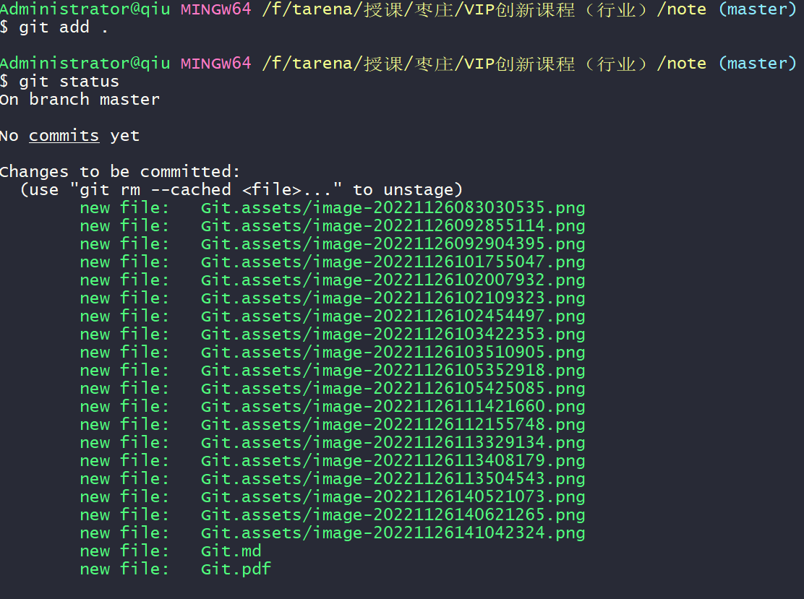

> 如果想把文件移出暂存区可以使用以下命令
>
> git rm --cached <file>...

### 保存仓库的历史记录

```bash
git commit -m "FirstCommit"
```

可以将暂存区中的文件实际保存到仓库的历史记录中。通过这些记录，我们可以在工作数中复原文件。

其中`-m "FirstCommit"`称作提交信息，是对提交的概述

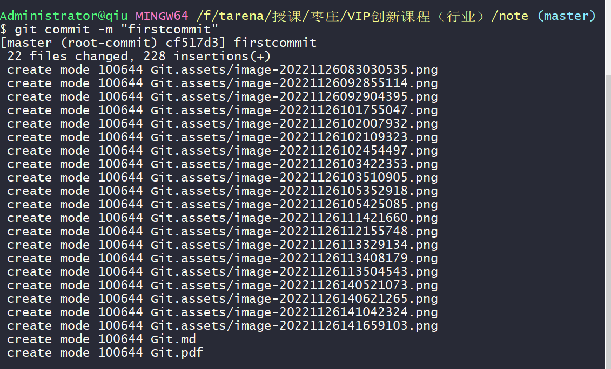

如果直接用git commit命令,会启动一个编辑器,在编辑器中记录要提交的信息。

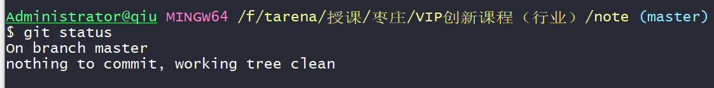

当前工作树处于刚刚完成提交的状态, 结果显示没有更改

### 查看提交日志

git log可以查看以往仓库中提交的日志

可以查看什么人在什么时候进行了提交或合并,以及操作前后有怎样的差别

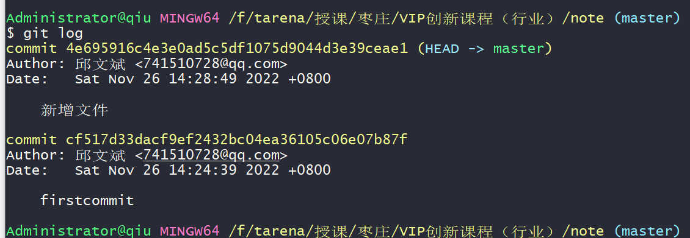

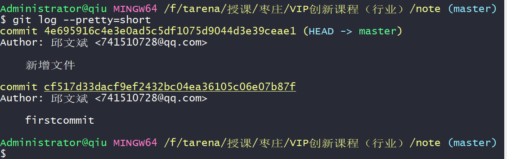

只显示指定目录或文件的日志

```bash
git log 文件名/目录名
```

显示文件的改动

```bash
git log -p 文件名/目录名
```

### 查看更改前后的差别

git diff

查看工作树、暂存区、最新提交之间的差别。

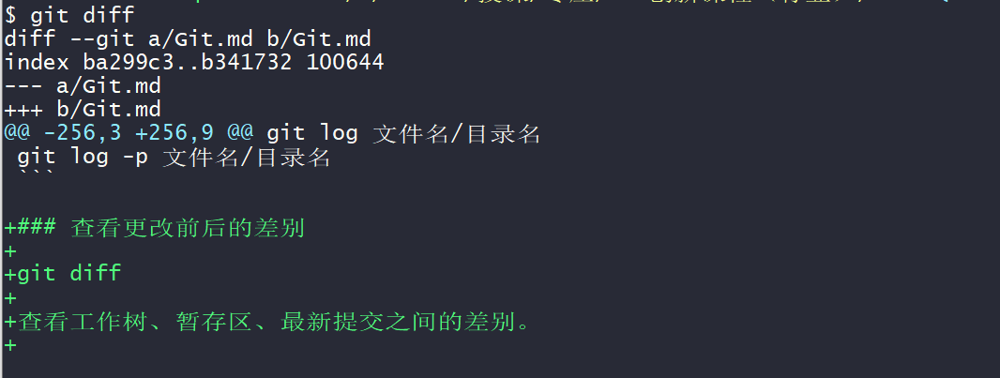

执行git add之后，工作树和暂存区的状态并无差别，结果什么都不会显示。

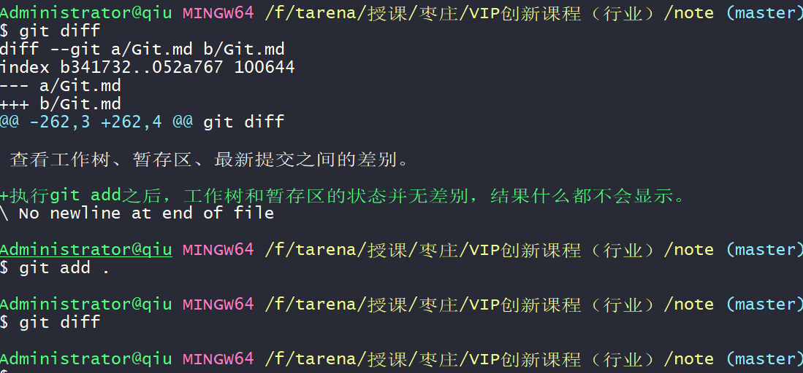

可以使用以下命令

```bash
git diff HEAD
```

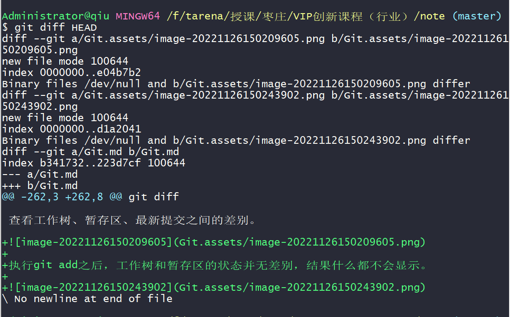

查看本次提交和上一次提交之间有什么差别，等确认完毕之后，再进行提交（在执行git commit之前，要执行下git diff HEAD）

HEAD指当前分支中最新的依次提交的指针。

在提交之前，多查看下，提交之后，可以查看下日志，确认是否提交成功。

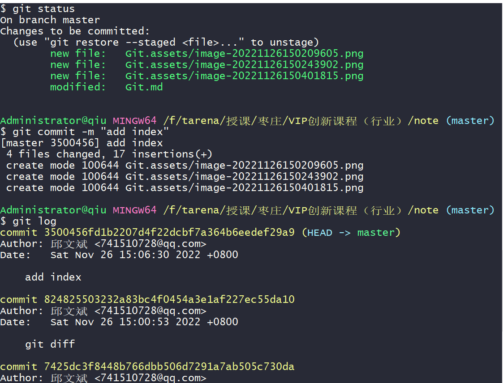

<<<<<<< HEAD
=======
## 分支操作

master分支是git默认创建的分支，基本上所有的开发都是以master为中心进行的。

可以在不同的分支中，同时进行完全不同的作业。等各个分支的作业完成之后，再与master分支进行合并。

使用分支可以让多人同时高效的进行并行开发。

### 显示分支

```bash
git branch
```

将分支名的列表显示，可以确认当前所在分支。

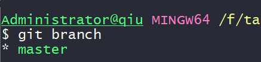

master左面的✳，表示我们当前所在的分支。

### 创建、切换分支

```bash
git checkout -b 分支名
```

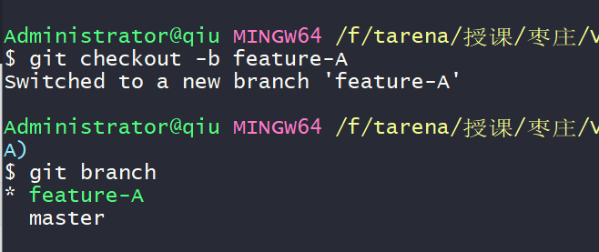

> 执行下面两条命令也可以达到同样的效果
>
> git branch 分支名
>
> git checkout 分支名

不断对一个分支进行提交操作，称之为：培育分支

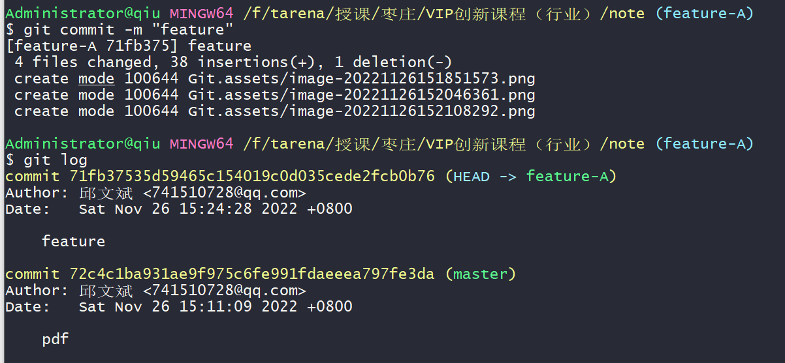

如果想切换回master分支，可以执行`git checkout master`

可以切换回master分支，查看master分支下的文件是否有变化

以下图片是切换回master分支之后，查看的git日志情况

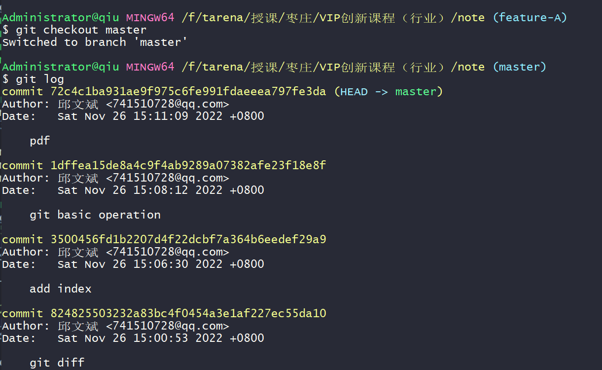

### 特性分支

Topic

集中实现单一特性，除此之外，不进行任何作业的分支。

日常开发中，会保留一个稳定分支做发布用，通常是master分支。

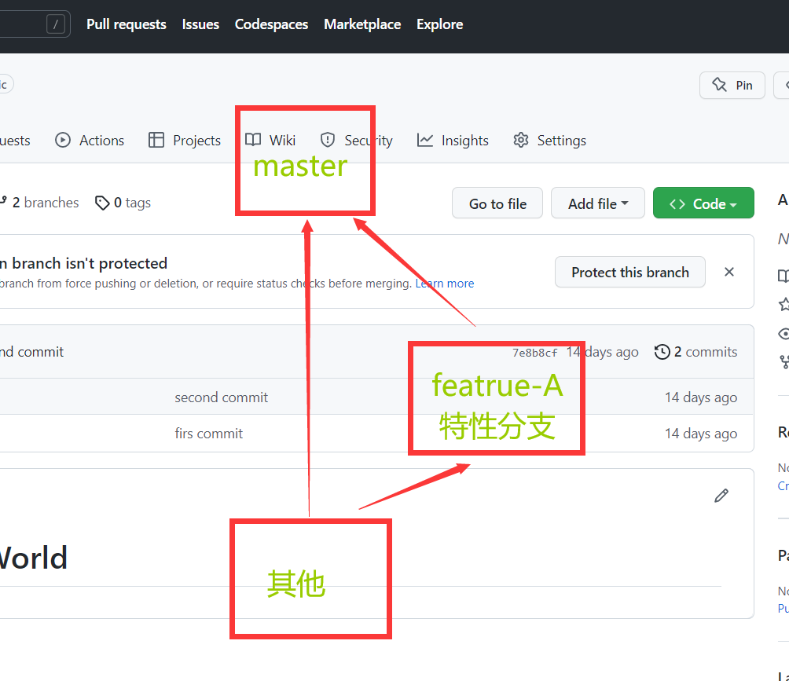

### 主干分支

是特性分支的原点，也就是合并的终点。

master

Tag创建版本信息，管理多个版本的发布。

### 合并分支

```bash
git merge
```

想要实现合并分支到主干分支master中，首先切换到master分支

```bash
git checkout master
# 为了在历史记录中明确记录本次的分支合并，我们要创建合并提交，参数 --no-ff
git merge --no-ff feature-A
```

# >>>>>>> feature-A
### 以图表形式查看分支

```bash
git log --graph
```


## 更改提交的操作

Git可以灵活操作历史版本

```bash
git reset --hard 哈希值
```

#### 创建fix-B分支

```bash
# 特性分支
git checkout -b fix-B
echo "fix-B" >> readme.txt
git add .
git commit -m "fix-B"
git reflog # 查看操作日志，可以看到所有的git命令执行记录，但是不要用git的GC，可以使用git reglot恢复到原先的状态
git checkout master 
git reset --hard f078ada # 以图表形式查看分支
git reset --hard 21b4d1c  #合并到master
```

#### 消除冲突

```
# 合并fix-B
```

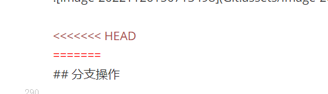


用编辑器打开文件的时候，会发现出现如上图代码，如果是md文件，需要通过查看源码模式查看。

=======以上的部分是当前HEAD的内容，以下的部分是要合并的分支中的内容。

实际开发中，可能需要删除其中之一，所以在处理冲突的时候，要仔细分析冲突部分的内容或代码，再进行修改。

#### 修改提交信息

```bash
git commit --amend
```

## 推送至远程仓库

### 添加远程仓库

```bash
git remote add origin https://github.com/waqwb/git-note.git
```

### 推送至远程仓库

#### 推送至master分支

```bash
git push -u origin master
```

- -u：在推送的同时，将origin仓库的master分支设置为本地仓库当前分支的上游（upstream），添加了这个参数，在将来我们运行git pull命令的时候（从远程仓库获取内容），本地仓库的这个分支就可以直接从origin的master分支获取内容
